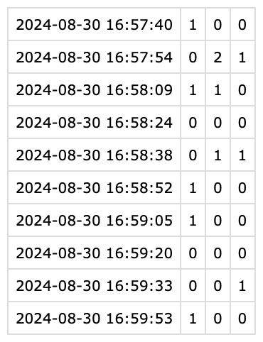
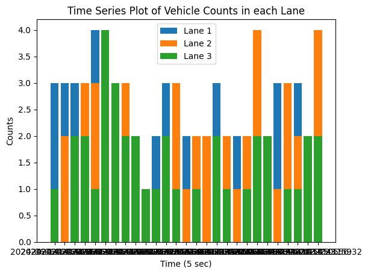

# Vehicle Detection Classification Tracking and Speed Estimation using YOLOv8 and Supervision. 
Speed estimation is done utilizing the perspective transformation method, considering the distance between each lane marking as 10 meters, which is standard in New Zealand.

# Output Video File
The code will generate an output video showing each vehicle's class and speed as it passes.

# Output CSV File
The code will generate an output .csv file with a timestamp followed by vehicle counts in each lanes in each column.

# Output Plot
The code will generate an output plot containing a stacked bar graph displaying the number of cars passing through each lane each second.

